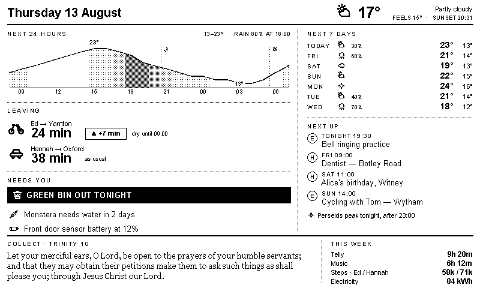
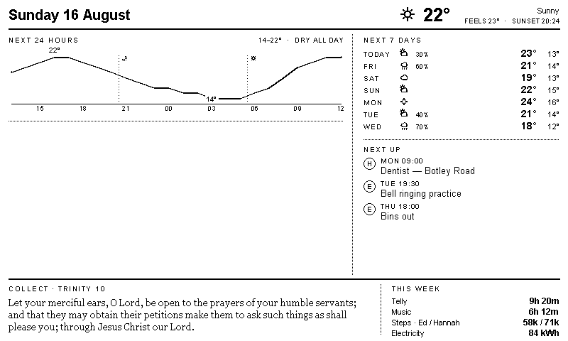

# Hallway panel

A battery-powered 7.5″ monochrome e-paper dashboard for the hallway, driven by
Home Assistant. Home Assistant renders an 800×480 1-bit PNG; an ESP32 wakes,
fetches it, pushes it to the panel, and goes back to sleep.



## Why a PNG and not ESPHome lambdas

Drawing on the device is the more usual approach and it very nearly won. What
decided it:

* **Glyph lists.** ESPHome fonts need every character declared up front, and
  anything undeclared renders as a black box. Calendar titles are arbitrary
  text — curly apostrophes, em-dashes, accents — so that would be a permanent
  maintenance tax.
* **Reflow.** The collect is wrapped serif, the alert list varies in length, and
  the commute block disappears entirely after 09:00. Vertical reflow in lambdas
  is unpleasant.
* **The graph.** Per-hour dither density clipped under a temperature curve is a
  few lines with Pillow and a slog otherwise.

The cost is a service to host and a blank panel if it dies, which the ESP
mitigates by caching the last good image and falling back to a stored card.

## Design rules

The panel is 1-bit. There is no grey, which drives three constraints:

1. **Hierarchy comes from size and weight, never colour.** A secondary value is
   a smaller, lighter value beside a bigger one.
2. **Solid black is an alarm, not decoration.** Exactly one element fills black —
   the bin alert, on the two evenings a fortnight it matters. Everything else is
   outlined, so the dark bar reads from the end of the hall without being read.
3. **Dither is the only tint.** Ordered 4×4 tiles at 6/12/25/50% give four
   shading steps for the rain fill. Anything needing a fifth wants a different
   chart.

Blocks collapse rather than draw empty headings, so a dull Sunday looks like
this — no "Leaving", no "Needs you", no shading under the graph:



## Layout

Left column is *today, act now*. Right column is *ahead, plan around*. The bottom
band closes with the collect and the week's numbers.

## Running it

```bash
pip install -r requirements.txt
python render_panel.py --sample                      # busy weekday morning
python render_panel.py --sample --scene quiet        # dull Sunday
python render_panel.py --sample --scale 2 -o out/big.png
python tools/icon_sheet.py                           # icon contact sheet
```

Both fixtures render without Home Assistant, so the layout can be worked on
offline. Live rendering is not wired up yet.

## Configuration

Everything switchable lives in [`config.yaml`](config.yaml) — Ed's workplace,
commute rules and thresholds, which bin is which, the four stat slots, and the
refresh schedule. Hannah's workplace is fixed today but uses the same shape as
Ed's so it can gain options without a code change.

The Home Assistant token is read from the environment (`HA_TOKEN` by default) and
is never written to the config.

## Layout of the code

| Path | What it does |
| --- | --- |
| `panel/model.py` | What the layout draws. No Home Assistant concepts — everything is already resolved and formatted, so the rule engine is testable without a display. |
| `panel/sample.py` | Two fixture scenes: a busy weekday morning and a quiet Sunday. |
| `panel/render/canvas.py` | 1-bit drawing surface: ordered dithering, tracked text, word wrap, dashed and half-tone rules. |
| `panel/render/icons.py` | Twenty icons as Pillow primitives, plus HA weather-state mapping. Not a font, so there is no TTF to ship and no glyph list to maintain. |
| `panel/render/fonts.py` | Font resolution with Windows and Debian fallbacks. |
| `panel/render/layout.py` | The 800×480 composition. Coordinates match the approved design. |

### One gotcha worth knowing

Mode `"1"` images make PIL select FreeType's monochrome rasteriser, which rounds
every glyph advance up to a whole pixel. `getlength()` defaults to antialiased
metrics and under-reports by roughly 50px across a line of body text. Every
measurement in `canvas.py` passes `mode="1"` explicitly. If text starts
overrunning its column, that is the first thing to check.

## Still to build

* Home Assistant client and the data sources (weather, commute, alerts,
  calendar, stats)
* Flask server with an ETag and a live preview page
* Add-on scaffolding — Dockerfile and manifest
* The collects table, keyed to the liturgical calendar and computed off Easter
* ESPHome firmware: wake, fetch, compare ETag, draw or skip, sleep
